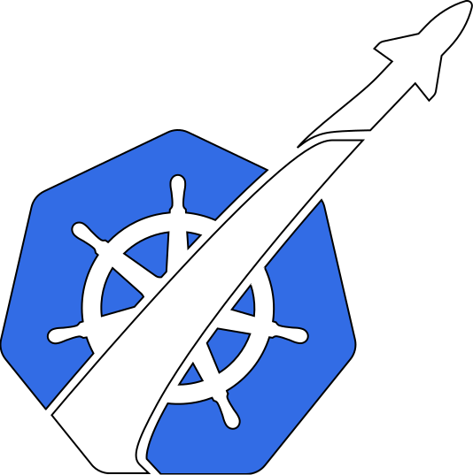

# Kubepilot 

Kubepilot is a centralized DevOps platform designed to simplify the management of Kubernetes resources, automate CI/CD pipelines with Tekton, and provide real-time observability for clusters—all from a modern web interface.

---

## 📌 Features

- **🌐 Unified Kubernetes Resource Management**  
  View, create, delete, and monitor Kubernetes workloads (pods, services, deployments) in real-time via a friendly ReactJS dashboard.

- **🔁 CI/CD Pipelines with Tekton (Drag & Drop)**  
  Create reusable Tekton pipelines through an intuitive visual editor using React Flow. Automate build, test, and deploy workflows without writing YAML manually.

- **📊 Real-Time Observability**  
  Integrated with Prometheus and Grafana Loki for collecting metrics and logs. Provides a unified dashboard for monitoring pod health, CPU/memory usage, and container logs.

- **🔐 Secure Authentication & Authorization**  
  Supports SSO using Keycloak (OpenID Connect). RBAC (Role-Based Access Control) is enforced at the interface and Kubernetes API level.

- **🔑 Secret Management**  
  Integrates HashiCorp Vault to securely manage and inject sensitive data (API keys, credentials).

- **📡 Event Streaming & State Coordination**  
  Uses Kafka and Zookeeper for coordination and service discovery across microservices.

---

## 🏗️ Architecture

Kubepilot follows a microservices-based architecture, where each Spring Boot service has a dedicated responsibility. The services communicate via REST and Kafka, and the entire system is orchestrated within a Kubernetes cluster.

### 🔧 Microservices Breakdown

| Layer | Microservice | Description |
|-------|--------------|-------------|
| **Service Registry** | `discovery-service` | Provides service discovery using **Spring Cloud Eureka**, allowing dynamic resolution between microservices. |
| **Configuration** | `config-service` | Centralized config management using **Spring Cloud Config**, backed by a Git repository. Provides dynamic configuration to other services. |
| **API Gateway** | `api-gateway` | Acts as the unified entry point for frontend requests. Handles routing, CORS, authentication forwarding, and load balancing. |
| **Authentication** | `auth-service` | Integrates with **Keycloak** for OAuth2 authentication. Handles user login, access tokens, and user roles. |
| **Cluster Management** | `cluster-configuration-service` | Manages credentials and metadata for registered Kubernetes clusters. Enables multi-cluster support by storing server URLs, tokens, etc. |
| **Infrastructure Management** | `infrastructure-service` | Interacts directly with the Kubernetes API (via **Fabric8**) to manage workloads: pods, services, deployments, namespaces, and more. |
| **DevOps Orchestration** | `devops-service` | Converts drag-and-drop pipelines into **Tekton** CRDs, submits them to the cluster, and tracks their execution. Streams task logs and status updates to the frontend. |

---

### 🔌 External Integrations

Kubepilot connects with a variety of tools to offer a complete DevOps and Kubernetes experience:

- **Tekton** – Kubernetes-native CI/CD system for pipeline execution
- **Prometheus** – Collects metrics from Kubernetes components and workloads
- **Grafana Loki** – Aggregates container logs for search and monitoring
- **Vault** – Manages secrets securely, with dynamic secrets and policies
- **Keycloak** – Handles user authentication and SSO with OpenID Connect
- **Kafka** – Used for sending pipeline task events and streaming logs
- **Zookeeper** – Supports Kafka’s distributed coordination
- **PostgreSQL** – Primary persistent database used by keycloak specifically to store users data

Frontend is built with **ReactJS** and interacts with the backend services through the `api-gateway`. Backend services use **Fabric8** to communicate with Kubernetes clusters securely and dynamically.

---

## 🎥 Demo Video

https://github.com/user-attachments/assets/7c2b56da-4cf5-4b16-8078-c417e816ed5a

---

## ⚠️ Confidentiality Notice

The source code of **Kubepilot** is strictly **confidential** and **not open source**.

---

## 📬 Contact

For further inquiries or assistance, feel free to reach out to me via [email](mailto:ghaith.saidani.contact@gmail.com) or [LinkedIn](https://www.linkedin.com/in/ghaithsaidani/).
